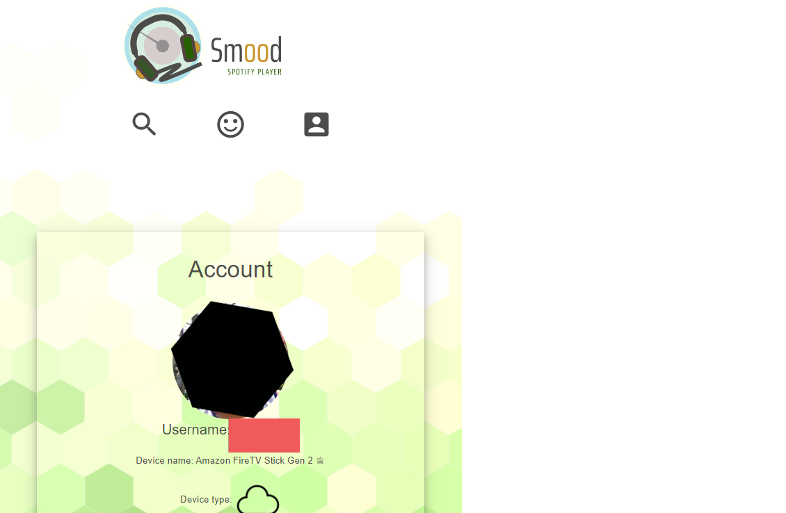
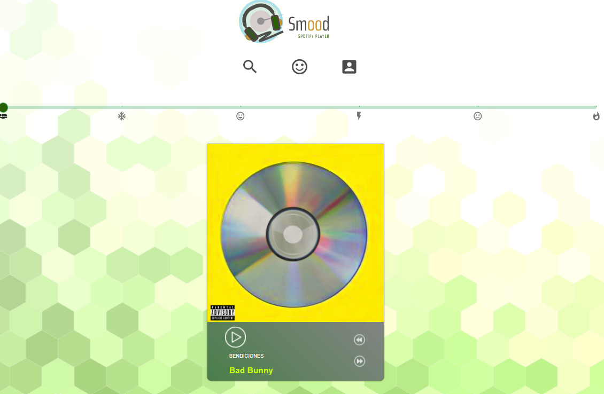
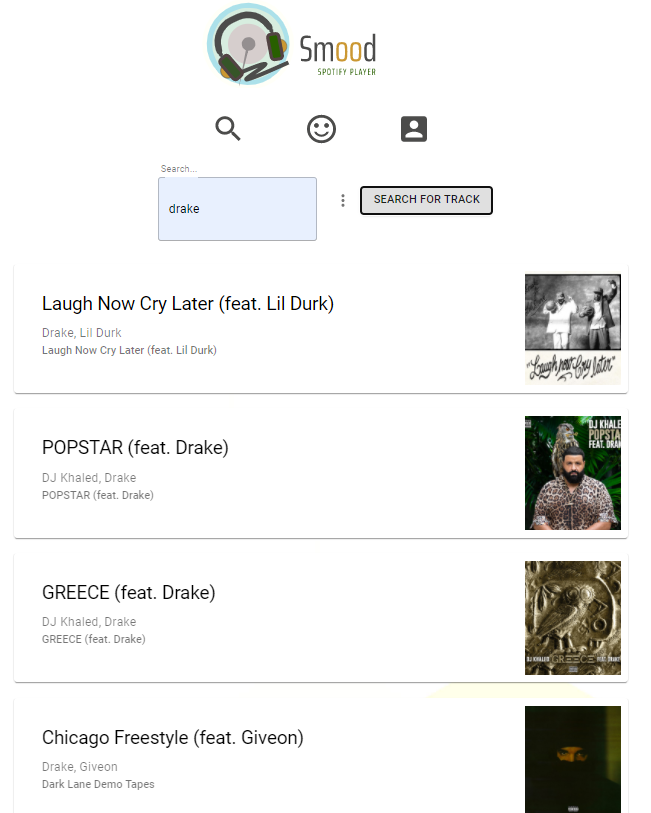

# 🏆 Project-Smood 🏆

##### **Badge:**

## **Description:**
* Our project is inspired by our love for music. Music has been widely used as a method for altering one’s emotional state. Using the Spotify Web API, our team decided to create an app which could help us with our project.  Whether one feels like working out at the gym or just relaxing on your couch, music can enhance that experience with ease and bring us closer to that state of mind. 
However, the user can also choose to search and play any track available depending on their own taste.  
 
## **Table of Contents:**
1. [Installation](#installation)
2. [Technology Used](#technology)
3. [Members](#members)
4. [Questions](#questions)
5. [Link](#link)
6. [Screenshots](#screenshots)

## **Installation:**
* Please use this link to deploy the app: https://projectsmood.herokuapp.com/

## **Technology:**
* Universal Music search
* Display info by Track, album,Artist and Playlist
* oAuth
* Routes.html: sign-up/sign-in, search music by mood
* Routes.API: results
* Libraries: node-spotify-api
* UI: React, Bootstrap and Material-UI
* Figma
* Adobe Illustrator
* Spotify Web API

## **Members:**
* Darren Huang
* Richard Antolin
* Sulada Sudjai
* Tristan Pacba
* William Flores

### **Questions:**
* support@project-smood.com

### **Link:**
* [GitHub] -https://github.com/tpacba/project-smood
* [GitHub] -https://github.com/tpacba/project-smood-backend

### **Screenshots:**

-------------
© Copyright - 2020

